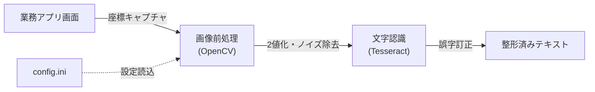

# BankInfo OCR Automation 🏦

 

デスクトップ上の特定アプリケーションウィンドウから「金融機関情報（銀行コード・銀行名・支店コード・支店名）」をキャプチャし、OCR（光学文字認識）を用いてテキストデータ化する自動化ツールです。
RPA（WinActor等）で取得が難しいレガシーシステムや、テキストコピーができない画面からのデータ抽出を支援します。

## 🚀 背景・解決した課題

業務システムの中には、画面上の文字をコピー＆ペーストできない仕様のものがあります。
これまでは目視で転記していましたが、入力ミスや工数の無駄が発生していました。
本ツールは、**OpenCVによる画像前処理**と**Tesseract OCR**を組み合わせることで、高精度なテキスト抽出を実現しました。

## ⚙️ 処理フロー



## 📦 機能

* **ターゲットウィンドウ自動検出**: 設定されたタイトルを持つウィンドウを自動でアクティブ化してキャプチャします。
* **高精度な画像処理**:
    * 必要な4項目（銀行コード/名、支店コード/名）をピンポイントで切り出し。
    * グレースケール、2値化（Otsu）、ノイズ除去（モルフォロジー変換）、スケーリングを組み合わせ、認識率を向上。
* **誤字訂正辞書**: 「級行 → 銀行」など、OCR特有の誤変換を自動補正する機能を搭載。
* **外部設定ファイル**: 座標や前処理パラメータを `config.ini` で調整可能（リビルド不要）。

## 🛠 動作環境

* OS: Windows 10
* Python: 3.13.9
* 必須ツール: [Tesseract-OCR](https://github.com/UB-Mannheim/tesseract/wiki) がインストールされていること

## 📖 使い方

### 1. インストール

```bash
git clone [https://github.com/skibidikids/GetbankCode.git](https://github.com/skibidikids/GetbankCode.git)
cd GetbankCode

# 必要なライブラリをインストール
pip install -r requirements.txt
```

※ `requirements.txt` には以下を含めてください:
`opencv-python`, `numpy`, `pygetwindow`, `pytesseract`, `Pillow`, `configparser`

### 2. 設定 (config.ini)

実行環境に合わせて `config.ini` を編集します。

* **[Paths]**: Tesseractのインストールパスを指定してください。
* **[OCR]**: キャプチャしたいウィンドウのタイトル（一部一致可）を設定します。
* **[Capture]**: 取得したい画面上の座標（x, y, width, height）を指定します。

```ini
[Paths]
Tesseract = C:\Program Files\Tesseract-OCR\tesseract.exe

[OCR]
WindowTitle = 対象の業務システム名
```

### 3. 実行

対象のウィンドウを開いた状態でスクリプトを実行します。

```bash
python main.py
```
成功すると、コンソールに結果が表示され
